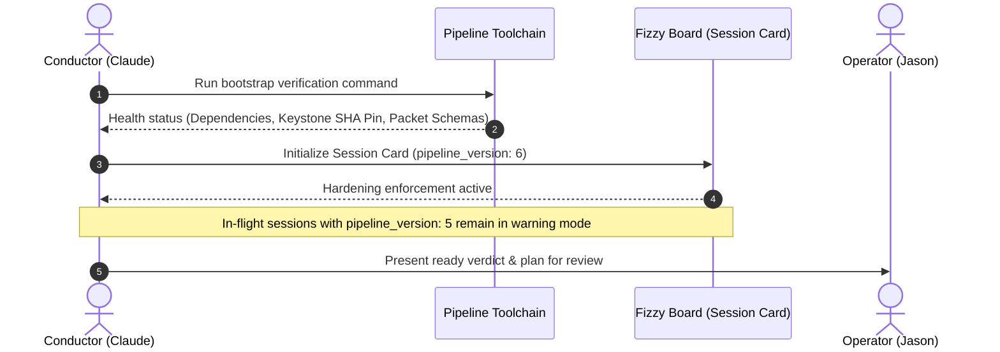
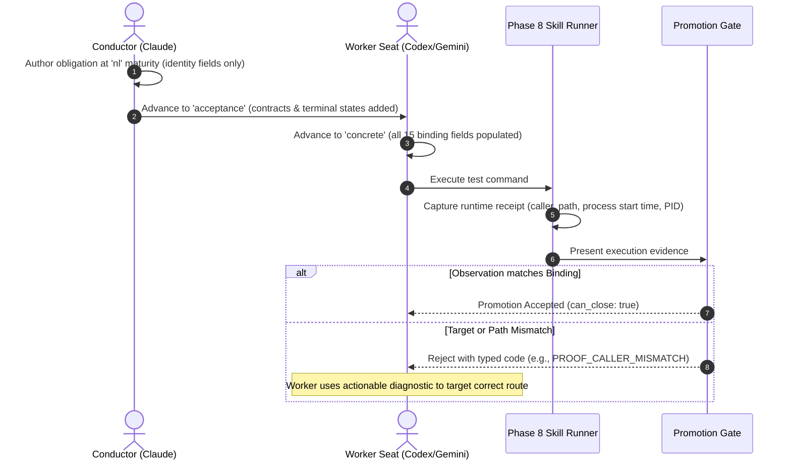

## Product Management Critique: Bounded Pipeline Reform & Hardening Alignment

### Executive Critique Summary
The submitted document (`Roadmap: Bounded Pipeline Reform & Hardening Alignment`) is an **engineering execution plan and test suite index**, not a Product Requirements Document (PRD). While it demonstrates deep technical rigor and an acute awareness of edge cases, it suffers from severe product-level deficiencies: it contains **no user journey**, provides **no properly formatted user stories**, lacks **critical failure and operator recovery use cases**, leaks **low-level technical implementation details** (e.g., Pydantic strict model types, SHA256 hashing algorithms, internal Python function names), and omits foundational PRD sections such as Personas, Non-Functional Requirements, and Risk Mitigations.

---

### Critical Requirements Review

#### 1. User Journey: CRITICAL GAP
* **Discovery:** The document never explains how a user (an AI conductor, worker seat, or human operator) discovers that target-binding rules apply to their current task. Does the CLI warn them? Does a card template prompt them?
* **First Interaction:** There is no documented path for a conductor opening a new or migrated session. What is the authoring workflow for annotating test obligations? When a worker runs a test, how does the system collect runtime identity without requiring manual configuration?
* **Time-to-Value:** When does the user experience value? The primary value proposition—*preventing tests from passing against the wrong route, process, or mock*—is obscured by internal milestone jargon. A clear journey showing how a developer avoids a silent regression or production cutover incident is completely absent.
* **Onboarding & Migration Path:** There is no path taking a project from un-hardened (`pipeline_version 5`) to hardened (`pipeline_version 6`). How an active repository like `prediction-prime` safely adopts target binding without failing in-flight work is left undefined at the user level.

#### 2. User Stories: CRITICAL GAP
* **Formatting:** The roadmap lists user stories as abbreviated shorthand (e.g., `US-1 target-bound obligations; US-2 progressive population`). Even within the companion requirements document, several stories are authored from internal system viewpoints rather than user-centric personas.
* **Missing Personas & Perspectives:**
  * **Worker Seats (`codex`, `gemini`):** How does a worker seat consume reject codes and remediate an implementation when an observation fails?
  * **Human Operator (Jason):** How does the operator review destructive custody requests, grant budget exceptions, and inspect grandfathered sessions?
  * **Downstream Project Maintainers:** How do engineers in consuming projects run local verifications without pipeline-wide tooling overhead?

#### 3. Missing Use Cases & Failure Scenarios
* **Error Diagnosis & Guided Remediation:** When a gate rejects an observation with `PROOF_CALLER_MISMATCH` or `FIXTURE_PROVENANCE_CEILING`, what is the exact user feedback? If error messages only emit machine codes without actionable remediation guidance, worker seats will spin in costly retry loops.
* **Custody Deadlock & Break-Glass:** If the custody budget is exhausted and an urgent incident or hotfix occurs, how does an operator safely authorize work without performing unverified manual deletions?
* **False-Positive / Math-Fixture Differentiation:** How does the system guarantee that legitimate mathematical/boundary-value fixtures (BVA) are not falsely blocked by the fixture provenance ceiling?
* **Cross-Repo Co-Migration:** What is the user experience when a cutover chain requires coordinated updates between an upstream provider (e.g., `Brainquarters` keystone) and a downstream consumer (`fizzy-pipeline-mcp`)?

#### 4. Goal Alignment & Human Guardrails (Contradiction Checks)
* **Goal G-1 vs. Fixture Provenance (US-6):** Goal G-1 asserts that target identity is added as an orthogonal axis to `REAL-DATA` *without weakening it*, while Non-Goals state there is *no fixture ban for BVA*. However, lexical and structural mock detection risks penalizing valid mathematical test fixtures. The PRD must explicitly guarantee zero friction for non-boundary calculations.
* **Goal G-3 vs. Custody Ledger (US-7):** Goal G-3 requires temporary custody to be itemized and *never destructive by inference*. The non-goals state there is *no auto-deletion*. However, blocking new worktree creation upon budget breach without providing a single-command operator remediation path creates an operational deadlock.
* **Goal G-4 vs. Past Hotfixes:** Goal G-4 mandates that all changes land post-finalize through the pipeline with grandfathering. Yet, historical context acknowledges that Defects A and B were hotfixed ahead of the session. The PRD must formalize the operational boundary between emergency hotfix exceptions and standard pipeline promotions.

#### 5. Separation of Product Requirements from Technical Specification
* The submitted document specifies JSON schemas, RFC 8785 canonicalization, git worktree directory layouts, and Python class signatures (`RunExecution`, `compute_tmr_record_hash`). 
* A PRD must define the **capabilities, behavioral contracts, user experience, and success criteria**, leaving internal architectural implementation, hashing algorithms, and code design to the Technical Specification and Architecture Diagnosis.

---

[SPEC]
# Product Requirements Document: Bounded Pipeline Reform & Hardening Alignment

## 1. Executive Summary
During the March–September 2026 operational cycles, multiple critical-path incidents surfaced a fundamental blind spot in automated testing: test suites proved **input reality** (`REAL-DATA`), but failed to prove **proof-target identity**. Tests successfully executed against harness callers, stale background processes, retired routes, or mock envelopes while claiming to validate live production boundaries. 

The **Bounded Pipeline Reform & Hardening Alignment** initiative introduces **proof-target identity** as an orthogonal, mandatory verification axis alongside `REAL-DATA`. It guarantees that automated evidence validates the intended caller, route, runtime process, and authority contract before permitting pipeline phase promotion. Additionally, it establishes structural authority census tracking, comprehensive cutover chains, and a strictly non-destructive custody ledger to ensure worktrees, branches, and temporary assets are never leaked or pruned by unverified inference.

---

## 2. Problem Statement & Opportunity

### 2.1 The Problem
Existing pipeline validation permits "successful" test runs that validate the wrong entity:
1. **Route & Caller Substitution:** An integration test runs through a testing harness or fallback route (e.g., `/exit`) and discharges an obligation intended for a primary product route (e.g., `/flatten`).
2. **Stale Runtime Execution:** A test suite validates against an orphaned daemon running stale code rather than the freshly built package artifact, masking breaking changes.
3. **Mock Evasion:** Boundary substitutions bypass lexical mock checkers (e.g., using helper functions like `makeEnvelope`), allowing simulated boundaries to pass as real-data verification.
4. **Authority & Custody Drift:** Multi-path migrations leave legacy authorities running unmonitored, while orphaned git worktrees and temporary branches proliferate without ownership or budgeted lifecycle controls.

### 2.2 The Opportunity
By establishing structural proof-target binding, runner-attested observations, and itemized custody management, the pipeline will deterministically eliminate false-positive test promotions, prevent authority divergence during migrations, and maintain zero unbudgeted disk sprawl—without slowing down routine single-path development.

---

## 3. Target Personas

| Persona ID | Persona Name | Role & Description | Primary Need |
| :--- | :--- | :--- | :--- |
| **P-1** | **Conductor (Claude)** | Orchestrating AI agent driving the 8-phase bounded pipeline. | Clear, progressive authoring contracts for obligations that are low-overhead for simple tasks and strictly enforced for critical seams. |
| **P-2** | **Worker Seats (`codex`, `gemini`)** | Specialized AI models implementing tasks, authoring tests, and reviewing PRDs/code. | Deterministic, typed rejection codes with actionable diagnostic messages instead of ambiguous prose or silent test failures. |
| **P-3** | **Operator (Jason)** | Human systems architect and final authority over live environments and capital risk. | Absolute protection against inferred destructive actions, guaranteed visibility into temporary custody, and seamless grandfathering of in-flight work. |
| **P-4** | **Pipeline Consumer (`fizzy-pipeline-mcp`)** | Downstream MCP orchestration service loading and validating plans and records. | Strict contract parity between pre-flight validation and post-load plan execution without schema divergence. |
| **P-5** | **Downstream Developer** | Engineers maintaining consuming services (e.g., `prediction-prime`). | Confidence that pipeline hardening catches live boundary regressions without penalizing pure mathematical or unit tests. |

---

## 4. End-to-End User Journeys

### 4.1 Onboarding & First Interaction (New User / New Session)

1. **Discovery:** The conductor initiates the session bootstrap command. The CLI inspects dependencies, keystone pins, and emitter suites, outputting a clear `READY`, `DEGRADED`, or `BROKEN` state within 5 minutes.
2. **First Interaction:** The conductor creates a Session Card specifying `pipeline_version: 6`. The toolchain automatically activates strict target-binding validation.
3. **Value Realization:** During test authoring, the conductor annotates critical seams. If a test accidentally hits a mock or alternative caller, the pipeline immediately flags the target mismatch *before* code implementation begins, saving multiple remediation cycles.

### 4.2 Progressive Test Obligation Authoring & Promotion

### 4.3 Operator Custody Exception & Safe Cleanup Journey
1. **Budget Breach:** A long-running session reaches its active worktree budget ceiling (e.g., 4 worktrees).
2. **Creation Blocked:** Attempting to create a 5th worktree fails with `CUSTODY_BUDGET_BREACH`. Crucially, **no existing worktrees are deleted**.
3. **Itemized Preview:** The toolchain generates an itemized custody preview detailing active paths, branch references, uncommitted files, and process dependencies.
4. **Operator Authorization:** The operator reviews the preview and issues an explicit override parameter to expand the budget or authorizes the specific retirement of completed worktrees.

---

## 5. User Stories & Use Cases

### 5.1 Test Obligations & Target Binding
* **US-1 (Target-Bound Test Obligations):** As a **Conductor**, I want triggered test obligations (spine tests, critical seams, cross-runtime boundaries, money-path effects) to require an explicit `target_binding`, so that a test cannot pass by exercising an unintended caller, harness wrapper, or deprecated route.
* **US-2 (Progressive Authoring Ladder):** As a **Conductor**, I want target-binding requirements to populate progressively across maturity levels (`nl` requires identity only; `acceptance` adds contracts and terminal oracles; `concrete` requires complete runtime slots), so that early architectural planning is not blocked by premature implementation details.
* **US-3 (Actionable Rejection Diagnostics):** As a **Worker Seat**, I want promotion rejections to return structured, typed error codes alongside the exact delta between expected binding and observed runtime data, so that I can immediately fix the test route or implementation without guessing.

### 5.2 Authority Census & Cutover Planning
* **US-4 (Structural Authority Census):** As a **Conductor in Phase 4 (Target Architecture)**, I want multi-path or role-migrating components to be structurally detected and cataloged in an `authority-paths.json` census, so that secondary or deprecated production routes cannot remain live without explicit verification.
* **US-5 (End-to-End Cutover Chains):** As a **Conductor in Phase 7 (Execution Planning)**, I want authority role changes to automatically generate a complete dependency cutover chain (producer, consumer, artifact, activation, running identity, acceptance, predecessor probe, and retirement), so that code changes and runtime process cutovers cannot close independently.
* **US-6 (Single Consumer Task per Caller):** As a **Worker Seat**, I want every censused caller of a migrating path to receive a dedicated plan task, so that no consuming service is left pointing to a decommissioned authority.

### 5.3 Execution Evidence & Runtime Observation
* **US-7 (Runner-Attested Observations):** As a **Pipeline Promotion Gate**, I want execution observations to be collected directly by the trusted test runner (including PID, process start time, and runtime receipt) and never authored by the test owner, so that evidence tampering or synthetic masquerading is impossible.
* **US-8 (Typed Boundary Provenance):** As a **Conductor**, I want boundary substitutions to declare their typed provenance ceiling while exempting pure mathematical/BVA fixtures, so that mock envelopes cannot masquerade as real data, while algorithmic unit tests remain unhindered.
* **US-9 (Terminal State Enum Coverage):** As a **Worker Seat**, I want the test oracle to validate all reachable terminal states of a state machine, so that silent timeouts or unhandled error enums cannot masquerade as successful completions.

### 5.4 Temporary Custody & Resource Lifecycle
* **US-10 (Non-Destructive Custody Ledger):** As an **Operator**, I want every pipeline-generated worktree, clone, and branch to be tracked in an append-only ledger with an explicit lifecycle disposition, so that all created assets are accounted for without risking automated deletion.
* **US-11 (Custody Budget Hard-Cap):** As an **Operator**, I want creation of temporary workspaces to be blocked when exceeding a pre-set budget limit, so that runaway disk sprawl is halted while preserving all existing active workspaces intact.
* **US-12 (Operator-Controlled Disposal):** As an **Operator**, I want workspace cleanup to require an itemized preview (listing dirty state, untracked files, and active locks) and explicit operator sign-off, so that human judgment is always preserved on the filesystem.

### 5.5 Rollout, Grandfathering & Audit
* **US-13 (Version-Fenced Grandfathering):** As an **Operator**, I want legacy sessions (`pipeline_version: 5` or earlier) and historical TMR registries to run under warning mode, while new sessions (`pipeline_version: 6`) strictly enforce hard rejects, so that in-flight development is never disrupted.
* **US-14 (Dogfood Verification & Process Record):** As a **Conductor**, I want the reform session itself to execute under the bounded pipeline ruleset and record any process anomalies in a dedicated backlog, so that the hardening mechanism is proven on its own deployment.

---

## 6. Functional Requirements

### 6.1 Target Binding & Obligation Schema
1. **Binding Trigger Matrix:** The pipeline shall mandate target binding if and only if a test meets at least one structural trigger:
   * It is designated as a happy-path spine test.
   * It crosses a critical seam (process, repository, network, or trust boundary).
   * It exercises an authority role change or cutover.
   * It touches a live money path or irreversible state effect.
2. **Progressive Validation:**
   * At Stage `nl`: Obligation requires only `outcome_id`, `caller_id`, and `path_id`. List fields default to empty arrays `[]`.
   * At Stage `acceptance`: Obligation additionally requires contract hashes (`producer_contract`, `consumer_contract`) and terminal oracle definitions.
   * At Stage `concrete`: Obligation requires all 15 target-binding fields, including runtime slot specifications and predecessor references.
3. **Obligation Integrity:** Expected target fields shall be included in the immutable obligation hash calculation; observed execution results (e.g., PID, execution timestamp, log URI) shall be strictly excluded to ensure observation updates do not invalidate prior waivers.

### 6.2 Authority Census & Cutover Engine
1. **Census Detection:** Phase 4 shall evaluate structural triggers (equivalent-effect paths, separate runtimes, authority migrations). If triggered, it must produce an `authority-paths.json` artifact; if un-triggered, it must record `triggered: false` with an explicit human-readable rationale.
2. **Cutover Completeness:** When a path changes role (e.g., `authoritative` $\to$ `retiring`), Phase 7 planning must mandate plan tasks for all eight cutover phases: Source Commit, Consumer Migration, Artifact Packaging, Activation Pointer, Running Process Identity, Acceptance Verification, Predecessor Negative Probe, and Retirement Disposition. Any omitted node must explicitly provide a validated `not_applicable(reason)`.
3. **Plan Discriminator Validation:** The pipeline plan serializer and loader must enforce strict integer schema versioning (`plan_schema_version: 3`). String, boolean, or float discriminators must be rejected at both self-check and MCP load.

### 6.3 Runner-Owned Target Observation & Promotion
1. **Attestation Authority:** Phase 8 promotion evidence shall accept target observations only when generated directly by the test execution runner, authenticated by a unique runner receipt ID and PID start-time stamp. Owner-authored observation blocks must be rejected.
2. **Typed Reject Catalog:** The promotion validator must evaluate runtime evidence against the bound target and emit standard, typed rejection codes upon mismatch:
   * `PROOF_CALLER_MISMATCH`: Test executed by an unauthorized or harness caller.
   * `PROOF_PATH_MISMATCH`: Test executed via a non-product or alternative route.
   * `PROOF_AUTHORITY_ROLE_MISMATCH`: Evidence produced by a predecessor or non-authoritative instance.
   * `RUNTIME_IDENTITY_INCOMPLETE`: Stale process, PID mismatch, or broken package-to-process lineage.
   * `FIXTURE_PROVENANCE_CEILING`: Mock or constructed envelope detected on a real-boundary obligation.
   * `TERMINAL_ENUM_UNCOVERED`: Reachable state machine terminal state omitted from the test oracle.

### 6.4 Custody Ledger Lifecycle
1. **Ledger Registry:** The pipeline shall record every pipeline-owned worktree, branch, clone, and release directory in a persistent, append-only ledger (`custody-ledger.jsonl`).
2. **Budget Enforcement:** If active pipeline-owned resources reach the configured ceiling (default: 4), subsequent creation requests must halt with `CUSTODY_BUDGET_BREACH`.
3. **Non-Destructive Guarantee:** The custody manager shall contain no automated filesystem deletion logic. Cleanup shall occur only via operator-executed commands following an itemized preview.
4. **Tool-Turn Exemption:** Subagent workspaces created and cleaned within the boundary of a single tool turn are exempt from ledger tracking. Any workspace persisting across tool turns must be recorded immediately.

---

## 7. Non-Functional Requirements

### 7.1 Performance & Latency
* **Bootstrap Verification:** The initial toolchain bootstrap check must complete in $< 5$ minutes on a standard developer workstation.
* **Gate Evaluation Overhead:** Target-binding validation, authority path validation, and custody ledger accounting must add $< 500\text{ ms}$ of latency to pipeline phase transitions.
* **Replay Harness Throughput:** Golden regression suite execution (18 incident cases + 3 controls) must execute in $< 60$ seconds.

### 7.2 Usability & Diagnostic Clarity
* **Actionable Rejections:** Every rejection message must display: (1) the failing rule, (2) the typed reject code, (3) expected vs. observed values, and (4) the exact remediation step required to unblock the gate.
* **Deterministic Output:** Given identical inputs, all validators and compiler steps must yield byte-for-byte identical JSON serialization (RFC 8785 compliant).

### 7.3 Safety & System Integrity
* **No Automated Destruction:** Under no circumstances shall any component execute unconfirmed deletions of branches, directories, or processes.
* **Process Isolation:** The toolchain must never execute broad process termination (`killall`, `pkill`, or pattern-based kills). Target processes must be addressed strictly by verified PID derived from the current session.

---

## 8. Success Metrics & KPIs

| Metric Category | Target KPI | Measurement Method |
| :--- | :--- | :--- |
| **Defect Regression Coverage** | **18 / 18** incident replays fail with expected codes; **3 / 3** controls pass. | Golden replay regression harness. |
| **Field Load-Bearing Coverage** | **100%** of target-binding fields covered by mutation tests producing specific typed codes. | Automated field mutation test suite. |
| **False-Positive Prevention** | **0** untriggered or single-path projects blocked by target-binding requirements. | Control project verification (`CTRL-001`, `CTRL-002`, `CTRL-003`). |
| **Ecosystem Stability** | **0** new test failures across existing suites; baseline skip sets unchanged. | Full regression run against `adversarial-spec` and `fizzy-pipeline-mcp`. |
| **Operational Cleanliness** | **0** unbudgeted worktrees or dangling branches surviving session close on card 21537. | Final session custody audit. |
| **Diagnostic Efficiency** | **$< 1$ minute** for a worker seat to diagnose a rejection via typed error codes. | Evaluation during Phase C debate and Phase 8 execution. |

---

## 9. Scope & Boundaries

### 9.1 In-Scope
* Definition and enforcement of the `target_binding` contract within the TMR schema.
* Structural triggers and schema for `authority-paths.json` (Phase 4).
* Cutover obligation generation and strict-int plan emission (Phase 7).
* Runner-owned runtime evidence capture and typed rejection catalog (Phase 8).
* Persistent append-only custody ledger and budget accounting.
* Cross-vendor review guardrail prompts targeting route and contract identity.
* Grandfathering fence keyed to `pipeline_version: 6`.

### 9.2 Out-of-Scope (Explicit Non-Goals)
* **No Automatic Deployment or Live Trading Actions:** The pipeline governs verification; it does not execute live financial transactions or production releases.
* **No Process Supervisor:** The pipeline monitors process PIDs and start times; it does not act as a daemon manager (e.g., `systemd`, `supervisord`).
* **No Codebase Diagnostic Replacement:** Does not replace existing codebase mapping tools (`mapcodebase`, `diagnosecodebase`).
* **No Blanket Fixture Ban:** Boundary Value Analysis (BVA), mathematical tests, and algorithmic isolation suites may freely use synthetic inputs without penalty.
* **No Automated File/Worktree Deletion:** The pipeline blocks on budget breach but never deletes user checkouts, branches, or worktrees.
* **No Universal Historical Ledger:** Does not backfill custody tracking for unmanaged, pre-existing developer directories.

---

## 10. Dependencies & Ecosystem Constraints

### 10.1 Technical Dependencies
1. **Brainquarters Keystone:** Canonical TMR schema definition (`test-maturity-record-schema.md`). All schema extensions must land keystone-first with SHA256 re-pinning before repository mirrors are updated.
2. **fizzy-pipeline-mcp:** MCP orchestration tool enforcing strict integer plan schema validation (`pipeline_validate_plan` / `pipeline_load`).
3. **Phase 8 Skill Runner:** Execution infrastructure responsible for capturing unforgeable runtime receipts (`phase8_promotion.py`).
4. **Python Runtime:** Python 3.14 environment with Pydantic strict mode and RFC 8785 canonical JSON hashing.

### 10.2 Coordination & Deployment Constraints
* **Live Symlink Precaution:** The deployed pipeline skill is symlinked directly to the active development repository; edits take effect immediately across all sessions. All skill code changes must be planned as post-finalize Phase 7 W-tasks to prevent disrupting active sessions.
* **Dual Vendor Quorum:** System-level debate and review must enforce cross-vendor independence (Claude conductor paired with Codex/Gemini review seats).

---

## 11. Risks & Mitigations

| Risk | Severity | Likelihood | Mitigation Strategy |
| :--- | :---: | :---: | :--- |
| **Worker Model Friction:** Worker seats get stuck on complex 15-field binding authoring. | High | Medium | Implement the **progressive authoring ladder** (US-2): early phases require only 3 fields; list fields default to empty arrays; strict population is deferred to concrete test maturity. |
| **Custody Deadlock:** Reaching the worktree budget halts an urgent bug fix during an active session. | Medium | Low | Provide an explicit, non-destructive **Operator Exception mechanism** that raises the budget limit without authorizing automated deletion. |
| **False Rejections on Math Tests:** Algorithmic or BVA unit tests get halted by the fixture provenance checker. | High | Medium | Explicitly scope provenance ceilings to declared external boundaries; verify that pure formula tests declare no replaced boundaries and pay zero ceiling tax (`CTRL-001`). |
| **Cross-Repo Schema Drift:** Discrepancy between Brainquarters keystone and downstream MCP validator breaks plan ingestion. | High | Low | Enforce **Keystone-First ordering tripwires** (`TC-1.4`) ensuring canonical commits precede local mirrors, backed by automated schema SHA validation. |
| **Retroactive Session Failures:** Existing in-flight sessions break upon loading newly hardened validators. | High | Low | Enforce a strict version fence: `pipeline_version <= 5` emits advisory warnings; only `pipeline_version >= 6` applies hard rejects (`US-13`). |

[/SPEC]